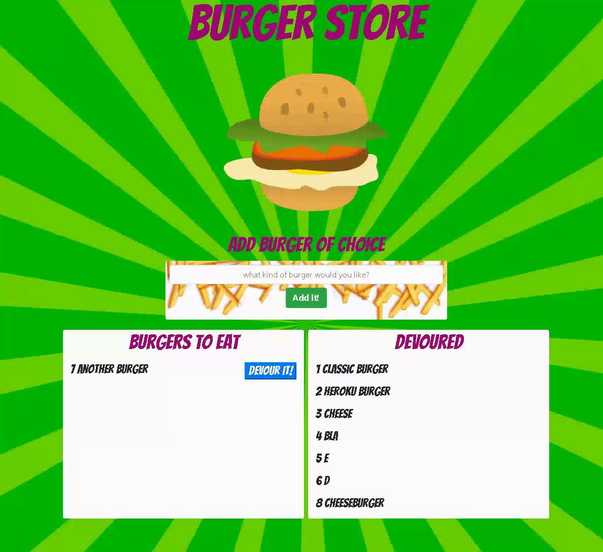

# Burger Store ORM

This is a full stack web application with a simple, personally designed, implementation of object relational mapping. The user may add a burger of their choosing to the list, and then 'devour' it if they choose. The application is designed within the 'Model-Viewer-Control' paradigm of system architecture. 

If you want to see it live, check it out  [here](https://frozen-badlands-55659.herokuapp.com/)

## Motivation

Hacing built various Full Stacl applications, this project was intended to supplement previous work by introducing a database (mySql) and tem[plating engine. These tools were very effective for data persistency (on the back end) and dynamic data rendering (on the front end). Given the growth of the web and move towards comprehensive web applications, and understanding of such tools is critical for all developers. 

## Getting Started

1. Install node.js and fork the repostory. 
2. in the command line, navigate to the forked directory and run `npm install`. 
3. Run the command `npm start` in the console. 
4. Go back to your browser and search for `localhost:8080`, and the app should appear. 

## Technology Used

* [Node.js](https://nodejs.org/en/) 
* [Express.js](http://expressjs.com/) - Web framework for setting up server
* [Handlebars.js](http://handlebarsjs.com/partials.html) - Templating Engine
 
